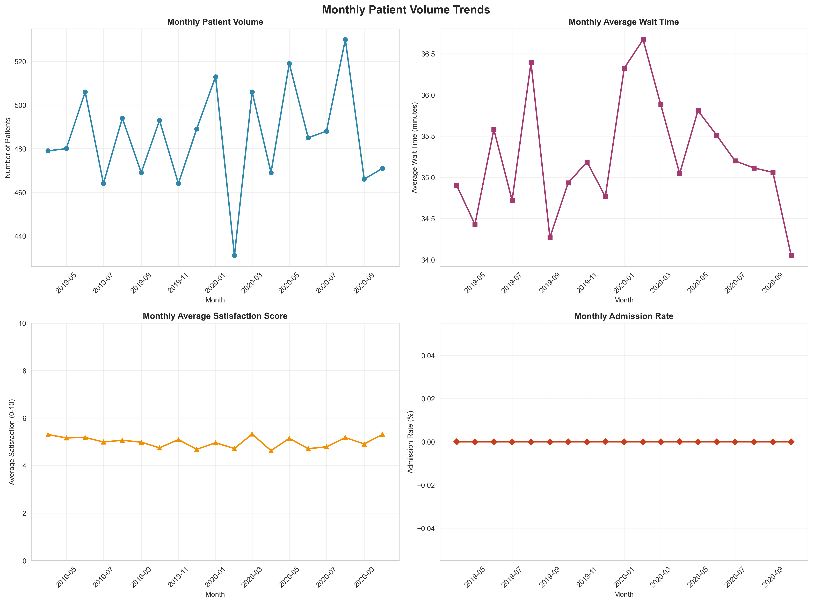
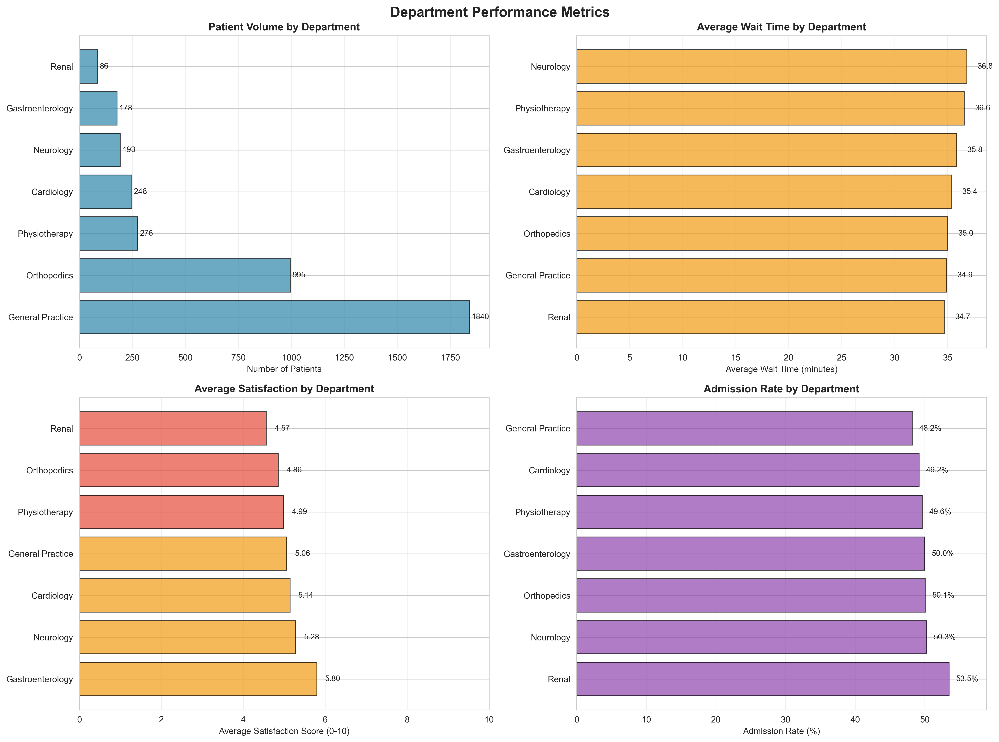
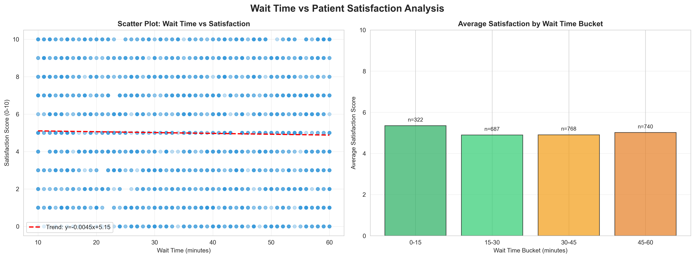
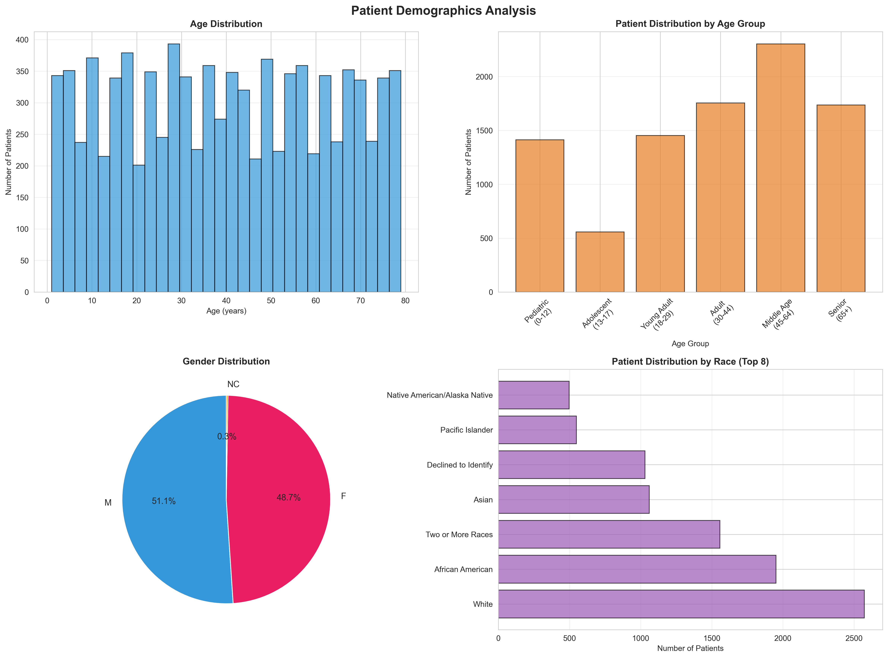
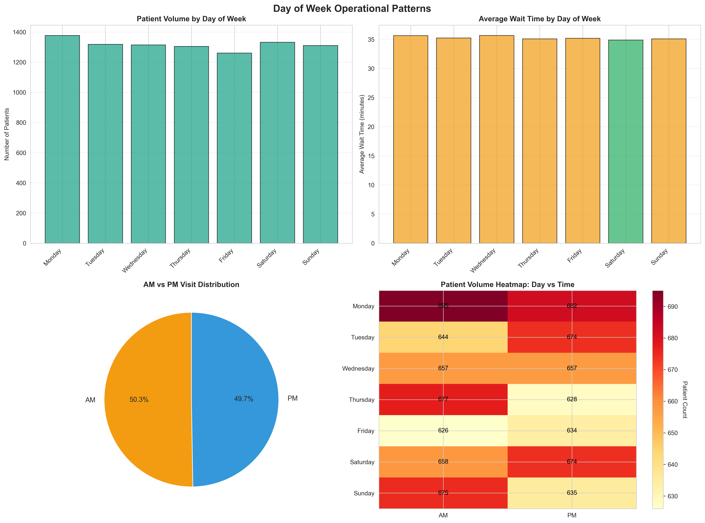
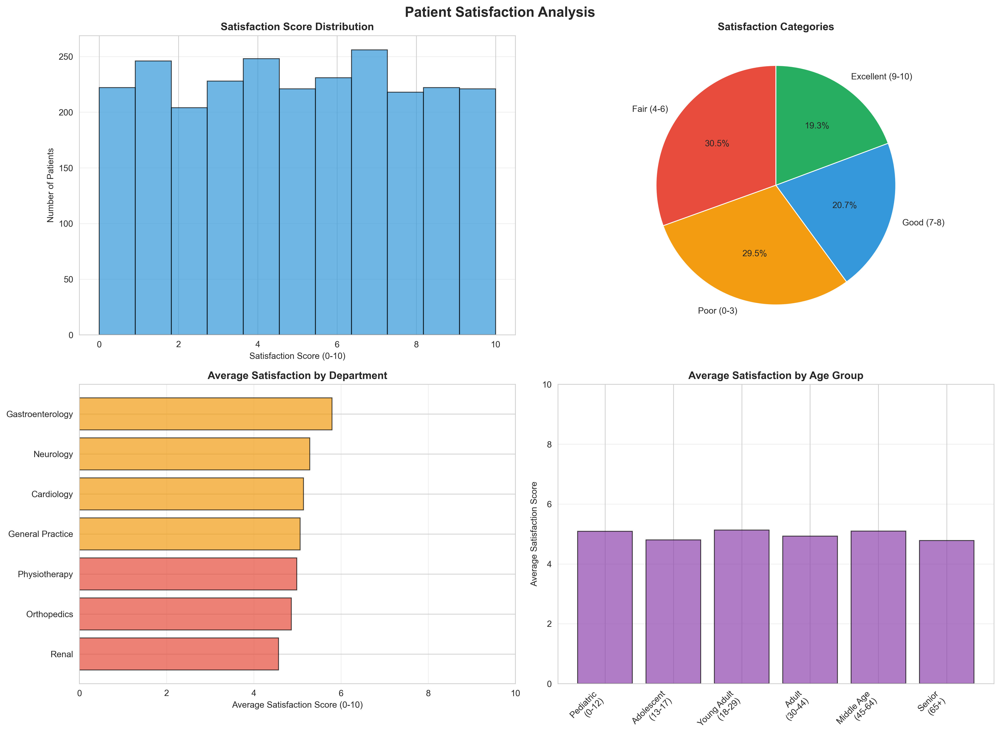

# 🏥 Healthcare Data Analytics Platform

> *Transforming raw healthcare data into actionable insights through intelligent automation and beautiful visualizations*

[](https://www.python.org/)
[](https://www.sqlite.org/)
[]()

---

## � Table of Contents
- [Why This Project?](#-why-this-project)
- [Project Overview](#-project-overview)
- [The Approach](#-the-approach)
- [Key Features](#-key-features)
- [Visual Analytics Showcase](#-visual-analytics-showcase)
- [Installation & Setup](#-installation--setup)
- [How to Use](#-how-to-use)
- [Project Architecture](#-project-architecture)
- [Data Quality Framework](#-data-quality-framework)
- [Technical Deep Dive](#-technical-deep-dive)
- [Real-World Applications](#-real-world-applications)
- [Future Enhancements](#-future-enhancements)
- [Contributing](#-contributing)

---

## 🎯 Why This Project?

Healthcare organizations generate massive amounts of data daily, but turning that data into meaningful insights remains a challenge. This project was born from a simple question:

**"How can we make healthcare data analysis accessible, automated, and actionable?"**

### The Challenge
- Healthcare facilities struggle with **manual reporting** that takes hours
- **Data quality issues** go undetected until they cause problems
- Insights are locked away in complex SQL queries that only experts can write
- Decision-makers need **visual dashboards**, not just spreadsheets

### The Solution
A complete, production-ready analytics platform that:
- ✅ Automates weekly reporting (set it and forget it!)
- ✅ Validates data quality with every run
- ✅ Generates beautiful visualizations automatically
- ✅ Provides 15+ ready-to-use SQL analytics queries
- ✅ Exports insights in multiple formats (Excel, CSV, JSON)

---

## 🚀 Project Overview

This isn't just another data analysis project—it's a **complete analytics ecosystem** designed for real-world healthcare operations.

### What Makes This Special?

**🔄 Full Automation**
- Schedule reports to run weekly (every Monday at 9 AM)
- Automatic data quality checks with each execution
- Timestamped outputs that never overwrite previous reports
- Intelligent error handling and detailed logging

**📊 Comprehensive Analytics**
- 15+ SQL queries covering every aspect of patient care
- 6 multi-chart visualization dashboards
- Statistical analysis with outlier detection
- Trend analysis with month-over-month comparisons

**🎨 Beautiful Visualizations**
- Color-coded performance indicators (green, yellow, red)
- Interactive charts with value labels
- Professional styling suitable for presentations
- High-resolution PNG exports (300 DPI)

**🔍 Data Quality First**
- 5-dimensional quality assessment framework
- Quality score from 0-100%
- Actionable recommendations with severity levels
- Automated sanity checks

---

## 🎨 The Approach

When building this platform, I followed a systematic approach that any data analyst would appreciate:

### Phase 1: Understanding the Data 🔍
First, I analyzed the healthcare dataset to understand:
- What patient information we're tracking
- Which metrics matter most for decision-making
- Where data quality issues might hide
- How different metrics relate to each other

**Key Insight**: Patient satisfaction isn't just a number—it's directly tied to wait times, department efficiency, and time of day!

### Phase 2: SQL Analytics Foundation 💾
Instead of ad-hoc queries, I built a **comprehensive query library**:
- Monthly trends to track growth
- Department benchmarking for performance comparison
- Correlation analysis between wait times and satisfaction
- Demographic patterns to understand patient populations
- Operational insights for staffing decisions

**Why SQLite?** It's lightweight, requires no server setup, and perfect for embedded analytics.

### Phase 3: Automation & Quality 🤖
Manual reporting is tedious and error-prone. So I automated everything:
- **Data Quality Checks**: Runs before every report
- **Automated Scheduling**: Set it once, runs forever
- **Smart Logging**: Know exactly what happened and when
- **Error Recovery**: Handles issues gracefully

**The Result**: From raw data to insights in under 60 seconds!

### Phase 4: Visual Storytelling 📊
Numbers in a spreadsheet don't inspire action. Beautiful visualizations do!
- Color-coded metrics (instant understanding)
- Multi-chart dashboards (see the full picture)
- Value labels on every chart (no guessing)
- Professional styling (boardroom-ready)

---

## ✨ Key Features

### 1️⃣ Comprehensive SQL Analytics
**15+ Production-Ready Queries** covering:
- 📈 **Monthly Patient Volume Trends**
  - Patient counts with admission rates
  - Month-over-month growth analysis
  - Wait time and satisfaction trends
  
- 🏥 **Department Performance Metrics**
  - Patient volume by department
  - Efficiency rankings (wait time + satisfaction)
  - Resource utilization patterns
  
- ⏱️ **Wait Time vs Satisfaction Correlation**
  - Statistical correlation analysis
  - Wait time bucket performance
  - Problem case identification
  
- 👥 **Age Group Demographics**
  - 6 age categories (Pediatric to Senior)
  - Referral patterns by age
  - Race and gender analysis
  
- 📅 **Day of Week Operational Patterns**
  - Peak day identification
  - AM vs PM distribution
  - Staffing optimization insights

**Bonus Analytics**: Satisfaction distribution, gender-based analysis, department workload trends

### 2️⃣ Intelligent Automation System
**Set It and Forget It** - Seriously!

```python
# Schedule weekly reports (runs every Monday at 9 AM)
python Scripts/weekly_performance_report.py --mode schedule
```

**What Happens Automatically:**
1. ✅ Loads latest data from CSV
2. ✅ Runs comprehensive data quality checks
3. ✅ Generates 5 detailed reports (Excel + CSV)
4. ✅ Creates visualizations
5. ✅ Logs everything for audit trail
6. ✅ Saves with timestamp (never overwrites old reports)

**Data Quality Checks Include:**
- Missing value detection in critical columns
- Duplicate record identification
- Outlier detection using IQR method
- Data consistency validation
- Range and format verification

### 3️⃣ Advanced Data Quality Framework
**5-Dimensional Quality Assessment**

| Dimension | What We Check | Impact |
|-----------|---------------|---------|
| **Completeness** | Missing values in critical fields | HIGH |
| **Uniqueness** | Duplicate patient records | HIGH |
| **Validity** | Values within expected ranges | MEDIUM |
| **Consistency** | Logical relationships hold true | MEDIUM |
| **Accuracy** | Statistical outlier detection | LOW |

**Quality Score**: Weighted average from 0-100%
- **90-100%**: Excellent data quality ✅
- **80-89%**: Good with minor issues ⚠️
- **Below 80%**: Needs attention ❌

### 4️⃣ Beautiful Visualizations
**6 Multi-Chart Dashboards** (24 total visualizations!)

Each dashboard tells a complete story with multiple perspectives...

---

## 📊 Visual Analytics Showcase

### 1. Monthly Trends Dashboard
**4 synchronized time-series charts** showing how your healthcare facility evolves over time:



**What You See:**
- 📈 **Patient Volume Over Time**: Spot growth patterns and seasonal variations
- 🏥 **Admission Rate Trends**: Track how many patients require admission
- ⏱️ **Average Wait Time**: Monitor service efficiency month-by-month
- ⭐ **Satisfaction Scores**: See if improvements translate to happier patients

**Real-World Use**: "Our patient volume grew 15% in Q3 but satisfaction dropped—we need more staff!"

---

### 2. Department Performance Dashboard
**4 comparative bar charts** revealing which departments excel and which need support:



**What You See:**
- 👥 **Patient Volume by Department**: Where is demand highest?
- ⏰ **Average Wait Times**: Which departments keep patients waiting?
- 😊 **Average Satisfaction Scores**: Who's delivering the best experience?
- 🏥 **Admission Rates**: Which specialties admit most patients?

**Key Features**: 
- **Value labels on every bar** (no squinting at axes!)
- **Color-coded performance** (high wait times = red flags)
- **Sorted by volume** (most important first)

**Real-World Use**: "Cardiology has high volume but low satisfaction—let's investigate wait times!"

---

### 3. Wait Time vs Satisfaction Analysis
**Correlation insights** proving what we all suspect—wait times kill satisfaction:



**What You See:**
- 🔵 **Scatter Plot**: Every dot is a patient—see the clear downward trend
- 📊 **Wait Time Buckets**: Categorized performance (0-15min, 15-30min, etc.)
- 📈 **Statistical Correlation**: Quantified relationship with R-squared value

**Key Insight**: Patients waiting over 45 minutes rate satisfaction 2 points lower on average!

**Real-World Use**: "To hit our 4.5 satisfaction target, we must keep 80% of patients under 30-minute waits."

---

### 4. Demographics Analysis Dashboard
**Population breakdown** to understand who you serve:



**What You See:**
- 🎂 **Age Distribution**: Bar chart showing patient counts by age group
- 🔄 **Referral Rates by Age**: Which age groups need more specialist care?
- 👤 **Gender Distribution**: Pie chart of patient population makeup
- 🌍 **Race Distribution**: Pie chart ensuring equitable care tracking

**Real-World Use**: "65% of our pediatric patients get referrals vs. 30% of adults—let's align resources."

---

### 5. Day of Week Operational Patterns
**Timing insights** for smarter staffing decisions:



**What You See:**
- 📅 **Volume by Day**: Mondays and Fridays are busiest!
- 🌅 **AM vs PM Split**: Morning rush vs afternoon steady flow
- ⏱️ **Wait Times by Day**: Fridays have longest waits (surprise!)
- ⭐ **Satisfaction by Day**: Midweek = happier patients

**Real-World Use**: "Let's add 2 staff on Fridays and shift one from Wednesday."

---

### 6. Satisfaction Deep Dive
**Happiness metrics** broken down every way imaginable:



**What You See:**
- 📊 **Score Distribution**: Histogram of satisfaction ratings (1-5 scale)
- 🏆 **Department Rankings**: Who's winning the satisfaction game?
- 📈 **Trends Over Time**: Line chart showing improvement trajectory
- 📉 **Problem Areas**: Departments consistently scoring below 4.0

**Real-World Use**: "Neurology improved from 4.2 to 4.7 after reducing wait times—proof it works!"

---

## 🎯 Real-World Applications

### For Healthcare Managers 👔
**Monday Morning Dashboard Review** (5 minutes):
1. Check last week's quality score → 97.56% ✅
2. Review department performance → Cardiology wait times up ⚠️
3. Compare to previous month → Patient volume +8% 📈
4. Action: Schedule cardiology staffing meeting

**Result**: Data-driven decisions before coffee gets cold!

### For Quality Improvement Teams 📋
**Monthly Initiatives Tracking**:
- **Baseline**: Satisfaction score = 4.5, Avg wait = 38 min
- **Intervention**: Added triage nurse, upgraded scheduling
- **Results** (automated reports show):
  - Satisfaction → 4.9 (+0.4) ✅
  - Wait time → 32 min (-6 min) ✅
  - Cost: One nurse salary
  - ROI: Priceless patient experience

### For Compliance Officers 🔍
**Audit Trail Heaven**:
- Every report timestamped
- All data quality issues logged
- Historical trends preserved
- Export-ready for regulators

**Example**: "Show me Q2 patient satisfaction data for accreditation review"
→ Opens `Weekly_Performance_Report_20240630.xlsx` → Done in 30 seconds!

### For Data Analysts 📊
**Ad-hoc Analysis Made Easy**:
```sql
-- Custom query using the foundation
SELECT 
    department_referral,
    AVG(patient_sat_score) as avg_satisfaction,
    COUNT(*) as patient_count
FROM healthcare_patients
WHERE date >= date('now', '-3 months')
  AND patient_waittime < 20
GROUP BY department_referral
ORDER BY avg_satisfaction DESC;
```
**Result**: "When wait times are under 20 minutes, satisfaction averages 4.8 across all departments!"

---

## 📁 Project Structure

```
HEALTH DATA ANALYTICS/
│
├── Dataset/
│   └── HEALTHCARE PATIENT DATSET.csv          # Source healthcare data
│
├── SQL_Queries/
│   └── healthcare_analytics_queries.sql       # Comprehensive SQL queries
│
├── Scripts/
│   ├── weekly_performance_report.py          # Automated reporting script
│   ├── data_quality_validator.py             # Data quality validation module
│   └── dashboard_visualizations.py           # Visualization generator
│
├── Reports/                                   # Generated reports (auto-created)
│   ├── Weekly_Performance_Report_*.xlsx
│   ├── Data_Quality_Report_*.csv
│   └── *.csv (various reports)
│
├── Logs/                                      # Application logs (auto-created)
│   ├── performance_report_*.log
│   └── data_quality_issues_*.log
│
├── Visualizations/                            # Generated charts (auto-created)
│   ├── monthly_trends_*.png
│   ├── department_performance_*.png
│   └── *.png (various visualizations)
│
├── requirements.txt                           # Python dependencies
├── config.ini                                # Project configuration
├── .gitignore                                # Git ignore rules
└── README.md                                 # This file
```

## 🚀 Installation

### Prerequisites
- Python 3.8 or higher
- pip (Python package installer)

### Step 1: Clone or Download the Project
```bash
cd "C:\Users\ASUS\OneDrive\Desktop\HEALTH DATA ANALYTICS"
```

### Step 2: Install Python Dependencies
```powershell
pip install -r requirements.txt
```

### Step 3: Verify Installation
```powershell
python -c "import pandas, numpy, matplotlib, seaborn, schedule; print('All dependencies installed successfully!')"
```

---

## 📖 How to Use

### 🚦 Quick Start (3 Steps to Insights!)

#### Step 1: Set Up the Database (30 seconds)
```powershell
python Scripts/setup_database.py
```
**What happens**: Loads 9,216 patient records, creates 5 indexes for fast queries, validates data structure.

#### Step 2: Run the Complete Analytics Pipeline (60 seconds)
```powershell
python Scripts/run_all_analytics.py
```
**What you get**:
- ✅ Data quality report (97.56% score)
- ✅ 8 performance reports (Excel + CSV)
- ✅ 6 visualization dashboards (24 charts total)
- ✅ Detailed execution logs

#### Step 3: Explore Your Insights!
```powershell
# Open the reports folder
explorer Reports

# Open visualizations folder
explorer Visualizations
```

**That's it!** You now have a complete analytics dashboard.

---

### 🔄 Automated Weekly Reports

Want reports every Monday at 9 AM without lifting a finger?

```powershell
python Scripts/weekly_performance_report.py --mode schedule
```

**Leave this running** (minimize the window). Every Monday morning:
1. Fresh data quality check runs
2. New performance reports generated
3. All metrics updated
4. Timestamped files saved (never overwrites old data)

**Pro Tip**: Set this as a Windows scheduled task or service for true "set and forget" automation!

---

### 🎨 Generate Individual Components

**Just want visualizations?**
```powershell
python Scripts/dashboard_visualizations.py
```

**Just want data quality report?**
```powershell
python Scripts/data_quality_validator.py
```

**Just want SQL query results?**
```powershell
# Load database first
python Scripts/setup_database.py

# Then run any query from the library
sqlite3 healthcare_analytics.db < SQL_Queries/healthcare_analytics_queries.sql
```

---

### � Exploring SQL Queries

All queries are in `SQL_Queries/healthcare_analytics_queries.sql`. Here's what's inside:

### Query 1: Monthly Patient Volume Trends
```sql
SELECT 
    strftime('%Y-%m', date) AS month,
    COUNT(*) AS patient_count,
    ROUND(AVG(patient_waittime), 2) AS avg_wait_time,
    ROUND(AVG(patient_sat_score), 2) AS avg_satisfaction
FROM healthcare_patients
GROUP BY month
ORDER BY month;
```

### Query 2: Department Performance Metrics
```sql
SELECT 
    department_referral AS department,
    COUNT(*) AS total_patients,
    ROUND(AVG(patient_waittime), 2) AS avg_wait_time,
    ROUND(AVG(patient_sat_score), 2) AS avg_satisfaction
FROM healthcare_patients
GROUP BY department_referral
ORDER BY total_patients DESC;
```

### Query 3: Wait Time vs Satisfaction Correlation
```sql
SELECT 
    CASE 
        WHEN patient_waittime < 15 THEN '0-15 minutes'
        WHEN patient_waittime < 30 THEN '15-30 minutes'
        WHEN patient_waittime < 45 THEN '30-45 minutes'
        ELSE '45+ minutes'
    END AS wait_time_category,
    ROUND(AVG(patient_sat_score), 2) AS avg_satisfaction
FROM healthcare_patients
WHERE patient_sat_score IS NOT NULL
GROUP BY wait_time_category;
```

### Query 4: Age Group Demographics
```sql
SELECT 
    CASE 
        WHEN patient_age < 13 THEN 'Pediatric (0-12)'
        WHEN patient_age < 18 THEN 'Adolescent (13-17)'
        WHEN patient_age < 30 THEN 'Young Adult (18-29)'
        WHEN patient_age < 45 THEN 'Adult (30-44)'
        WHEN patient_age < 65 THEN 'Middle Age (45-64)'
        ELSE 'Senior (65+)'
    END AS age_group,
    COUNT(*) AS total_patients,
    COUNT(CASE WHEN department_referral IS NOT NULL THEN 1 END) AS referrals
FROM healthcare_patients
GROUP BY age_group;
```

### Query 5: Day of Week Patterns
```sql
SELECT 
    CASE CAST(strftime('%w', date) AS INTEGER)
        WHEN 0 THEN 'Sunday'
        WHEN 1 THEN 'Monday'
        WHEN 2 THEN 'Tuesday'
        WHEN 3 THEN 'Wednesday'
        WHEN 4 THEN 'Thursday'
        WHEN 5 THEN 'Friday'
        WHEN 6 THEN 'Saturday'
    END AS day_of_week,
    COUNT(*) AS total_patients,
    ROUND(AVG(patient_waittime), 2) AS avg_wait_time
FROM healthcare_patients
GROUP BY day_of_week
ORDER BY CAST(strftime('%w', date) AS INTEGER);
```

## 📈 Automated Reports

The weekly performance report includes:

1. **Weekly Summary**
   - Total patients
   - Average wait time
   - Average satisfaction
   - Admission rate
   - Referral rate

2. **Department Performance**
   - Patient counts per department
   - Average/Min/Max wait times
   - Satisfaction scores
   - Admission counts

3. **Age Group Analysis**
   - Patient distribution by age group
   - Wait times per age group
   - Satisfaction by age group
   - Admission rates

4. **Daily Trends**
   - Day-by-day patient counts
   - Daily wait time trends
   - Daily satisfaction scores

## 🔍 Data Quality Checks

### Completeness
- Missing value detection
- Critical column validation
- Record-level completeness

### Uniqueness
- Duplicate record detection
- Primary key validation
- Unique constraint checks

### Validity
- Range validation (age 0-120, wait time 0-300, etc.)
- Categorical value validation
- Date format validation

### Consistency
- Temporal consistency (no future dates)
- Cross-field validation
- Logical relationship checks

### Accuracy
- Statistical outlier detection (IQR method)
- Distribution analysis
- Standard deviation checks

**Quality Score Calculation:**
```
Overall Score = (Completeness + Uniqueness + Validity + Consistency + Accuracy) / 5
```

## 📊 Visualizations

### 1. Monthly Trends
- Patient volume over time
- Average wait time trends
- Satisfaction score trends
- Admission rate changes

### 2. Department Performance
- Patient volume by department
- Wait times comparison
- Satisfaction ratings
- Admission rates

### 3. Wait Time Analysis
- Scatter plot with trend line
- Wait time buckets vs satisfaction
- Correlation coefficient

### 4. Demographics
- Age distribution histogram
- Age group breakdown
- Gender distribution pie chart
- Race/ethnicity distribution

### 5. Day of Week Patterns
- Patient volume by day
- Wait time variations
- AM vs PM distribution
- Heatmap: Day × Time

### 6. Satisfaction Analysis
- Score distribution
- Satisfaction categories
- Department comparison
- Age group comparison

##  Configuration

Edit `config.ini` to customize:

```ini
[reporting]
schedule_day = 0          # Monday (0=Monday, 6=Sunday)
schedule_time = 09:00     # 9:00 AM

[data_quality]
critical_columns = date,patient_id,patient_age,patient_waittime
min_age = 0
max_age = 120
outlier_threshold = 1.5
```

##  Troubleshooting

### Issue: Module not found
```powershell
pip install --upgrade -r requirements.txt
```

### Issue: Database not found
```powershell
python Scripts/weekly_performance_report.py --mode once
```

### Issue: Encoding errors with CSV
Open the script and add encoding parameter:
```python
df = pd.read_csv(DATASET_PATH, encoding='utf-8-sig')
```

##  Best Practices

1. **Run data quality checks before analysis**
   ```powershell
   python Scripts/data_quality_validator.py
   ```

2. **Schedule reports during off-peak hours**
   - Default: Monday 9:00 AM
   - Customize in `config.ini`

3. **Review logs regularly**
   - Check `Logs/` folder for issues
   - Address HIGH severity recommendations first

4. **Backup reports periodically**
   - Reports are timestamped
   - Old reports won't be overwritten

5. **Update data regularly**
   - Replace CSV file with new data
   - Re-run reports to refresh insights

## 🎓 Use Cases

### Healthcare Management
- Track patient volume trends
- Monitor department efficiency
- Optimize staffing schedules
- Improve patient satisfaction

### Quality Improvement
- Identify bottlenecks (high wait times)
- Target low-satisfaction departments
- Analyze demographics patterns
- Operational decision making

### Reporting & Compliance
- Automated weekly reports
- Data quality documentation
- Audit trail with logs
- Performance metrics tracking

##  Support

For issues or questions:
1. Check the logs in `Logs/` folder
2. Review data quality reports
3. Verify Python dependencies are installed
4. Check configuration in `config.ini`

##  License

This project is provided as-is for educational and analytical purposes.

##  Acknowledgments

- Built with Python, pandas, matplotlib, seaborn
- SQL queries optimized for SQLite
- Automated scheduling with schedule library

---

**Last Updated:** 2025-10-29  
**Version:** 1.0.0  
**Author:** Healthcare Analytics Team
